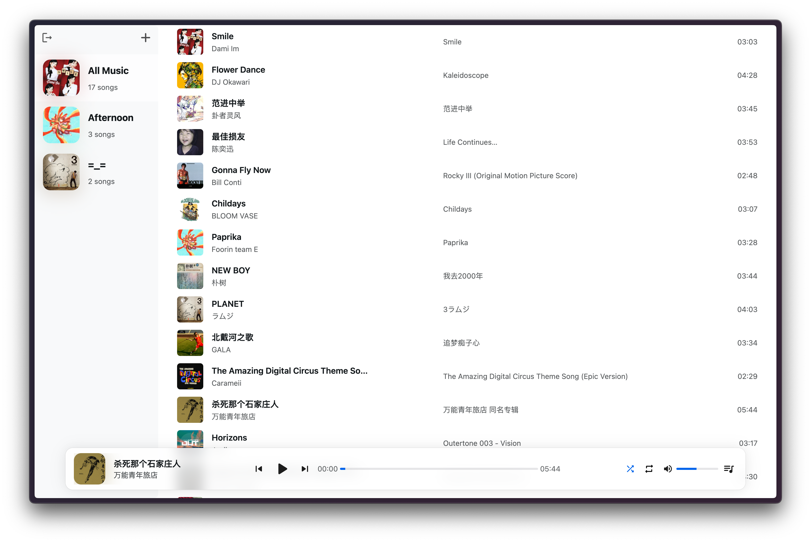
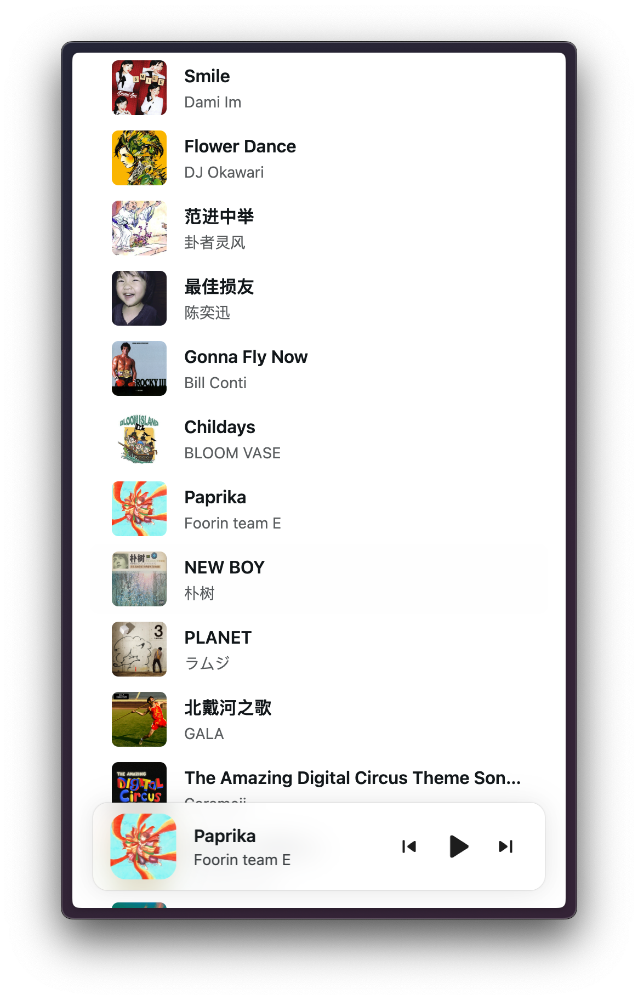

<div align="center">
    
    <h1>Beagle</h1>
    <p>An online music player with Alist support</p>
    <a href="https://beagle-ashy-psi.vercel.app">Demo</a>
</div>

[](https://github.com/JavanShen/corgi/actions/workflows/ci.yml) 

English | [中文](./README_zh.md)

## Features 🌟
- [x] Music lists
- [x] Parsing music metadata
- [x] Bottom player
- [x] Playback controls
- [x] Playback modes
- [x] Responsive
- [x] System Media Controls
- [ ] WebDAV support
- [ ] Cross-platform client
- [ ] Music Grouping
- [ ] Music Search
- [ ] Configuration Sync
- [ ] Fullscreen player

## Deployment 🚀
### Vercel 🛠️
[](https://vercel.com/new/clone?repository-url=https%3A%2F%2Fgithub.com%2FJavanShen%2Fbeagle&project-name=beagle&repository-name=beagle)

### Docker 🐳
```shell
docker run -d -p 3028:80 oneboluo/beagle
```

## Screenshots 📷


